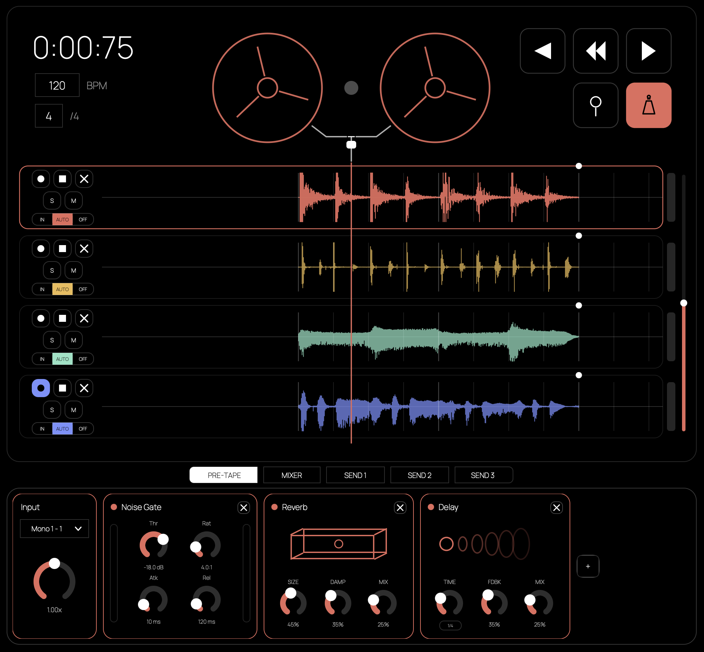

# 4-Track

A tape-style 4-track recorder. Record on 4 tracks, set loop markers, and print each track through its own pre-tape FX chain. Mix the tracks, send them into 3 post-tape effect buses, and export your session.



## Features

- 4 tape tracks with loop markers
- Pre-tape FX chain per track (EQ, compressor, saturation, delay, reverb, chorus, phaser, and more)
- 3 post-tape send buses
- Mixer with track routing and bouncing
- Export to WAV

## Download

Pre-built binaries: [4track.pulsarmachine.ro](https://4track.pulsarmachine.ro)

- **Windows** — .exe
- **Linux** — AppImage
- **macOS** — .app

## Build

### Prerequisites

- CMake 3.22+
- C++20 compiler
- [JUCE](https://github.com/juce-framework/JUCE) (included as submodule)

### Build steps

```bash
git clone --recursive https://github.com/raulpavel20/4-track.git
cd 4-track
cmake -S . -B build -DCMAKE_BUILD_TYPE=Release
cmake --build build --config Release
```

**Linux** — Install dependencies first:

```bash
sudo apt-get install -y ninja-build patchelf libasound2-dev libjack-jackd2-dev \
  libfreetype6-dev libx11-dev libxcomposite-dev libxcursor-dev libxext-dev \
  libxfixes-dev libxi-dev libxinerama-dev libxkbcommon-dev libxkbcommon-x11-dev \
  libxrandr-dev libxrender-dev libglu1-mesa-dev mesa-common-dev
```

Then configure with Ninja:

```bash
cmake -S . -B build -G Ninja -DCMAKE_BUILD_TYPE=Release
cmake --build build
```

## License

GNU Affero General Public License v3.0 — see [LICENSE](LICENSE).
